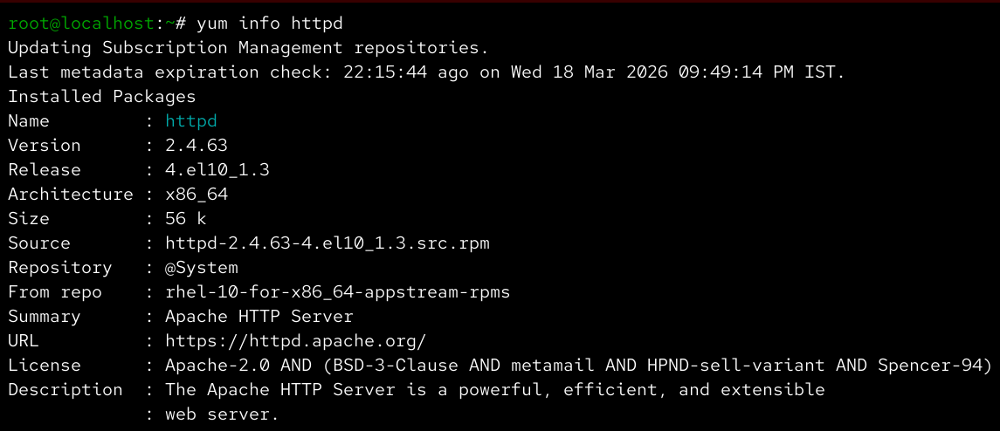
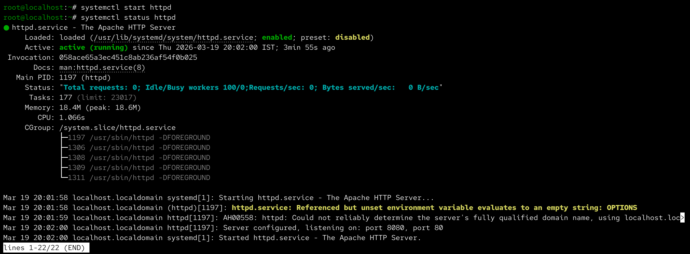
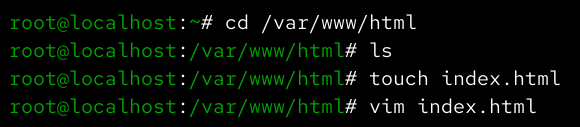
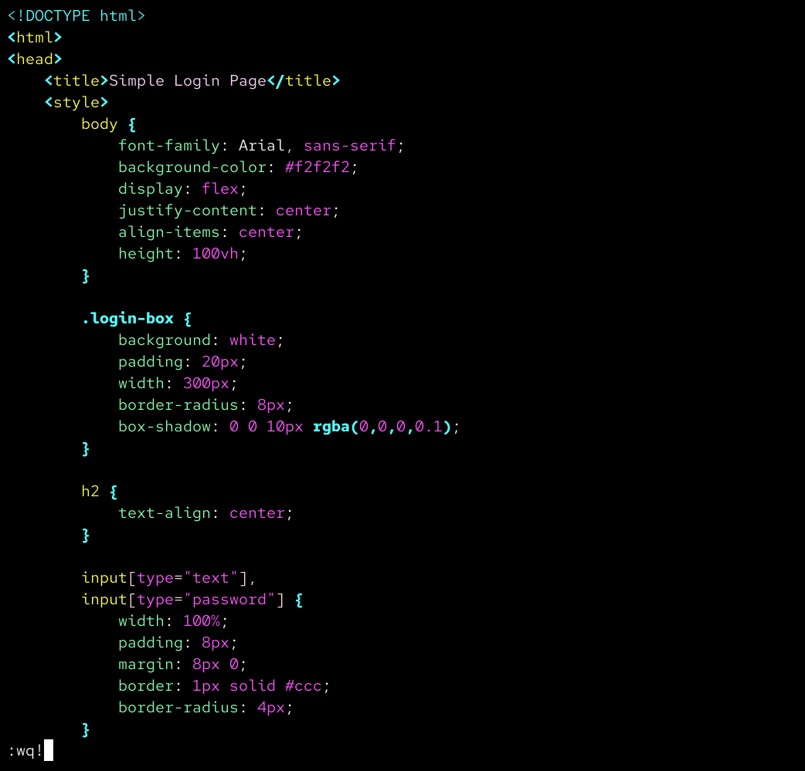
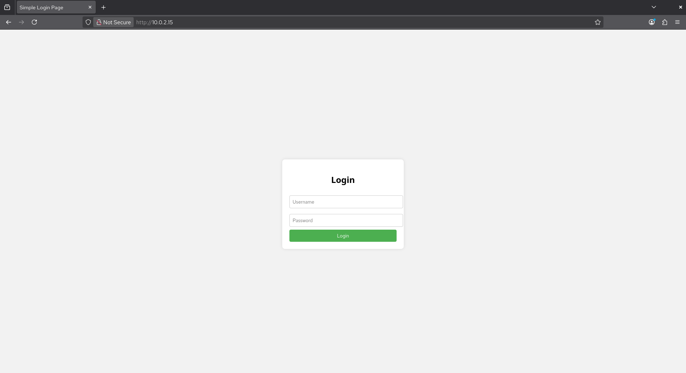
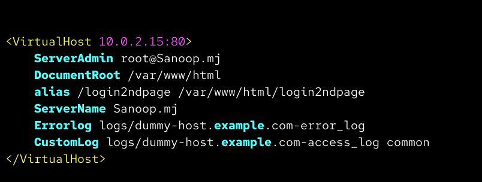
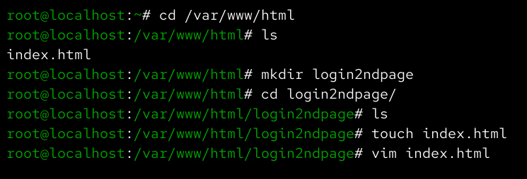
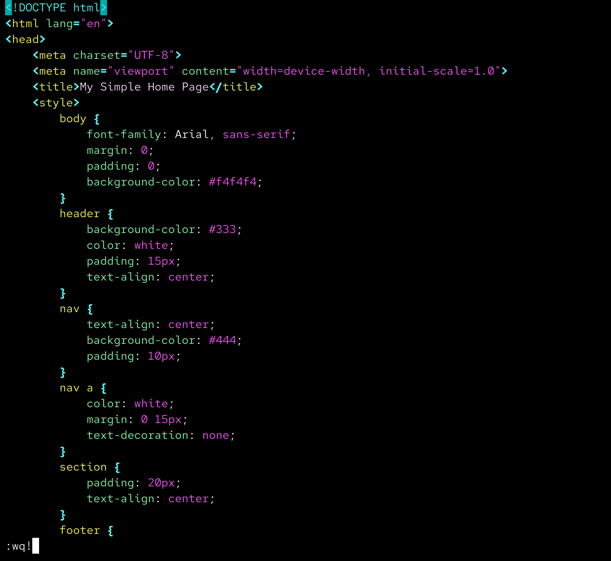
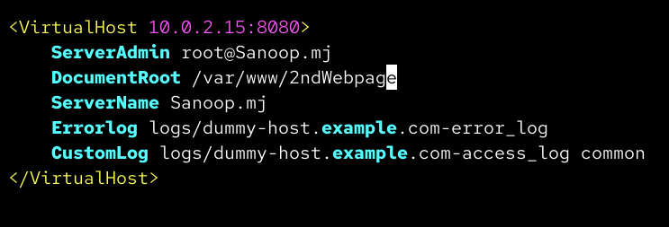
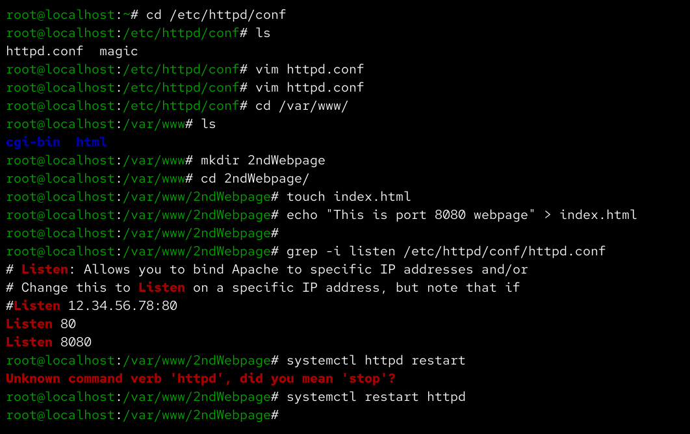

Apache Web Server Deployment and Configuration (Linux)

* Project Overview

Deployed Apache web server on Linux to host a static website.

⚙️ Technologies Used

- Linux
- Apache (httpd)
- Networking

🔧 Implementation Steps

- Installed Apache server
- Started and enabled httpd service
- Hosted a static website
- Configured firewall for HTTP traffic
- Configured additional port (8080)

📸 Screenshots

## httpd_install

## httpd_status

## index.html_file

## page1code

## mainwebpage

## httpdconf

## configfile

## subpagefile

## subpagecode

## subpage

## httpdconf

## listen8080

## 8080config

## 8080webpagecontent

## 8080webpage

✅ Outcome

- Successfully hosted website on Linux server
