Secure FTP Server Configuration using VSFTPD (Linux)

📌 Project Overview

Configured a secure FTP server using VSFTPD on a Linux system to enable controlled file transfer between client and server.

⚙️ Technologies Used

- Linux (RHEL/CentOS)
- VSFTPD
- Networking
- Firewall (firewalld)

🔧 Implementation Steps

- Installed VSFTPD package
- Configured FTP settings in vsftpd.conf
- Disabled anonymous login and enabled local users
- Created FTP user and assigned permissions
- Configured firewall to allow FTP traffic
  

📸 Screenshots

## To Get File 

## setenforce
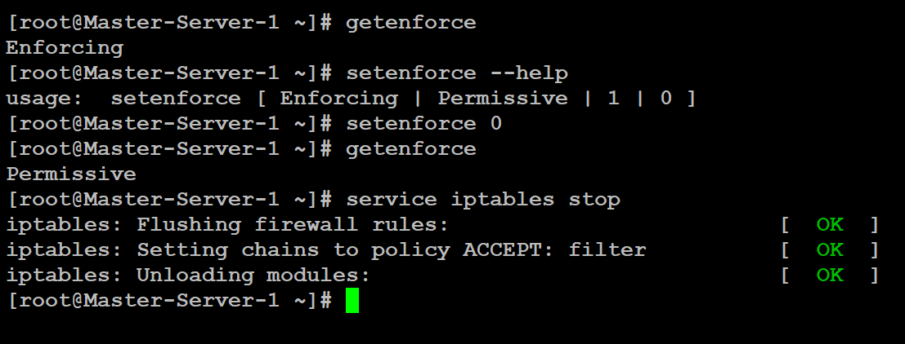

## clientsetenforce
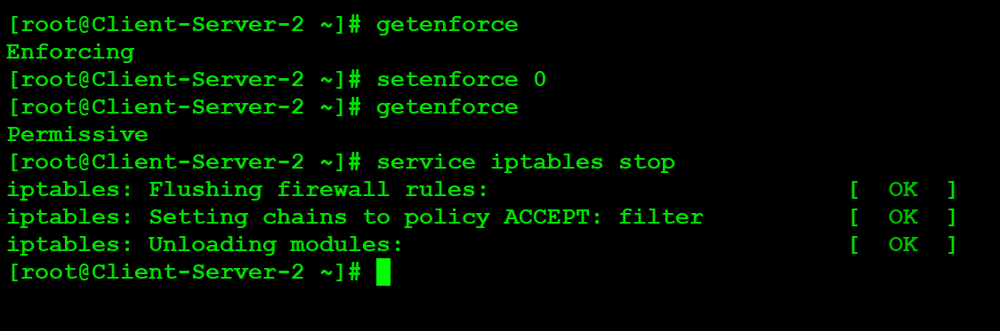

## installVSFTPD 
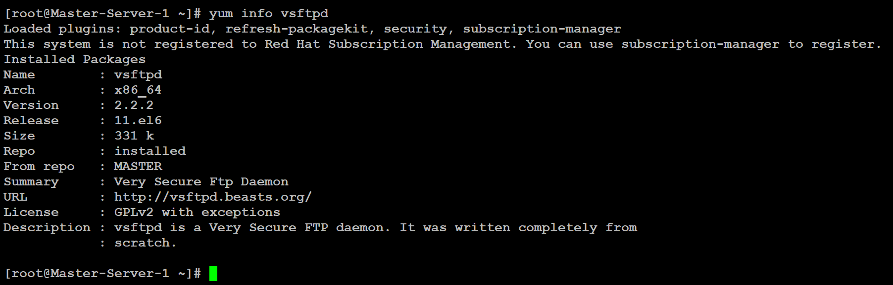

## startservice
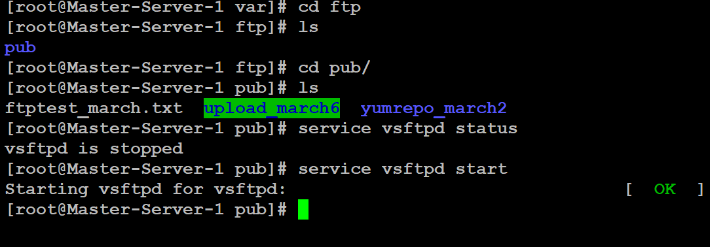

## getfile
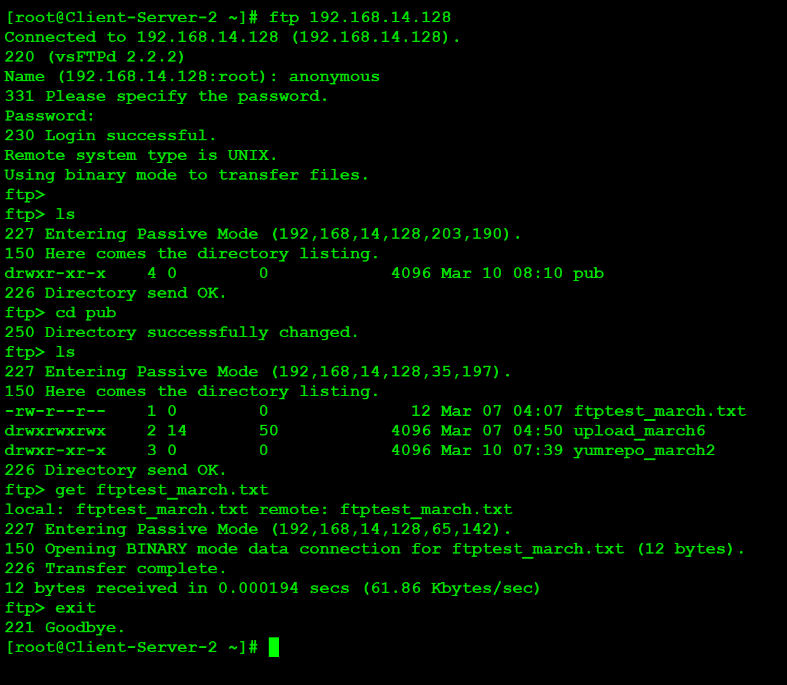

## To Upload File

## createfolder
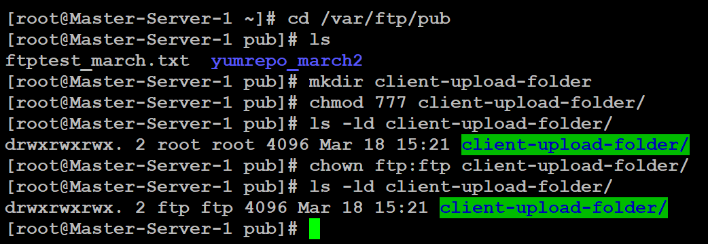

## createfile
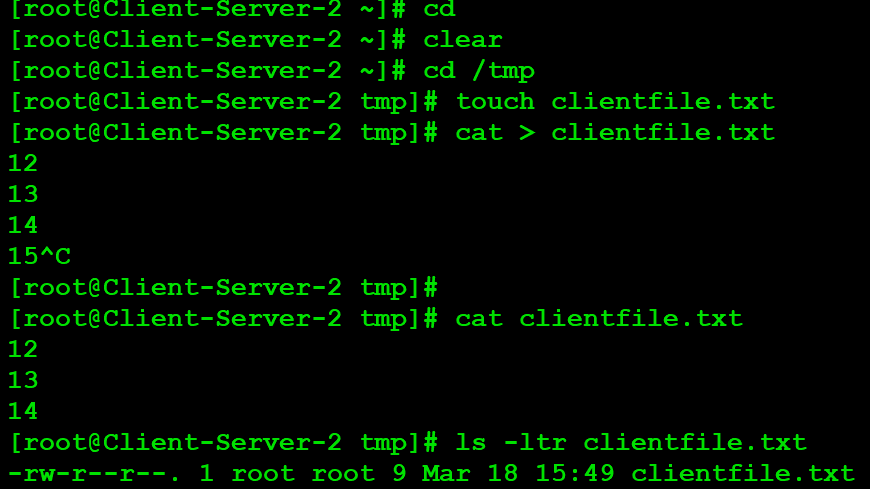

## VSFTPDconfigfile
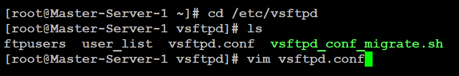

## enableanonymous
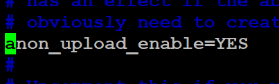

## loginftp
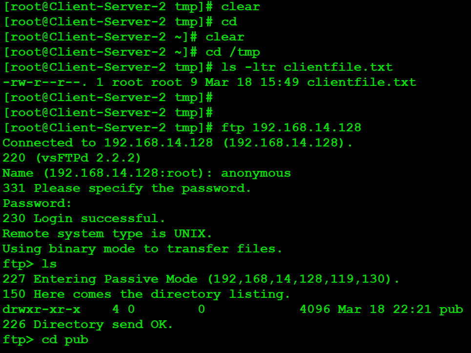

## uploadfile
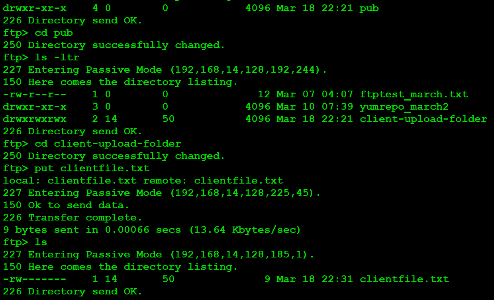

✅ Outcome

- Successfully transferred files between client and server
- Implemented secure and controlled FTP access
