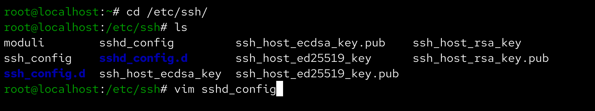
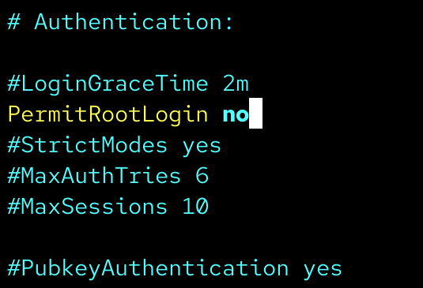
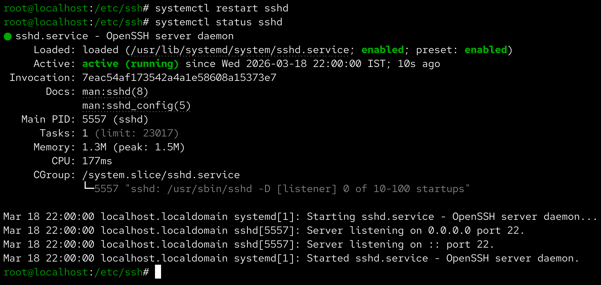
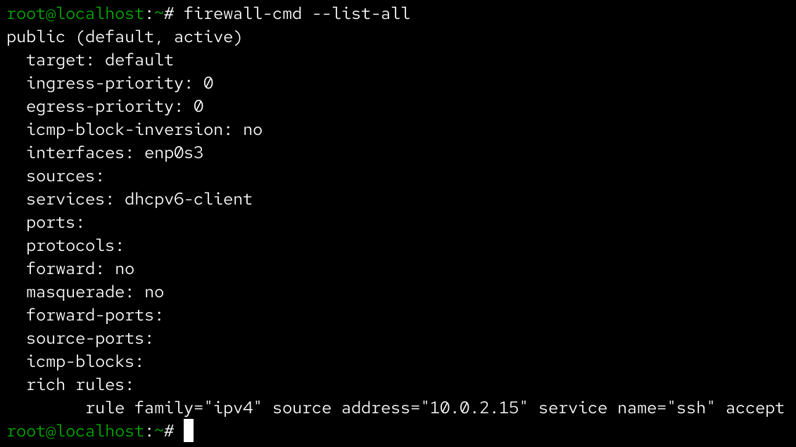
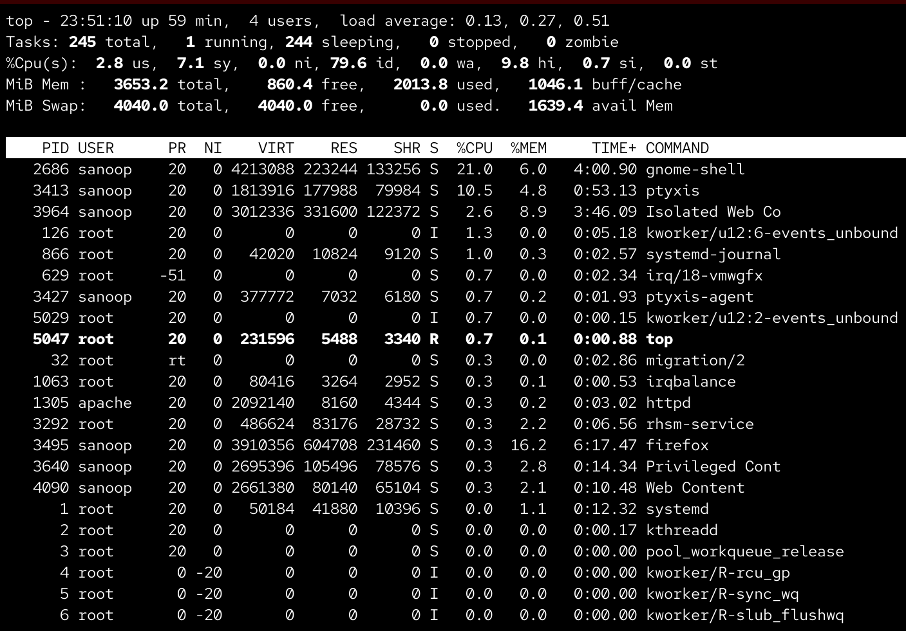
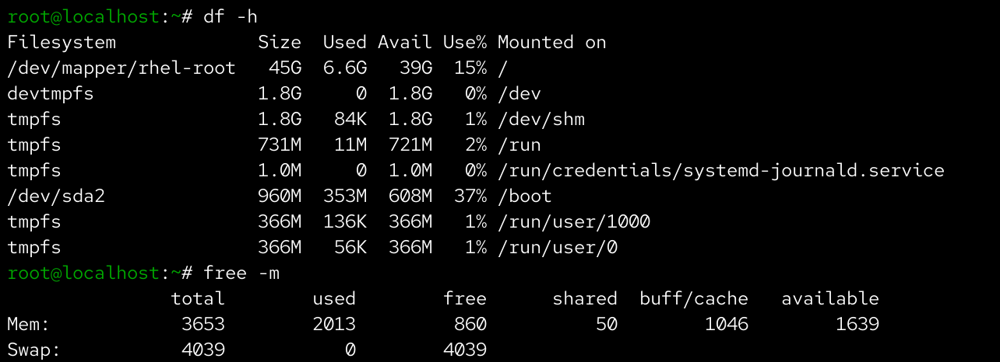
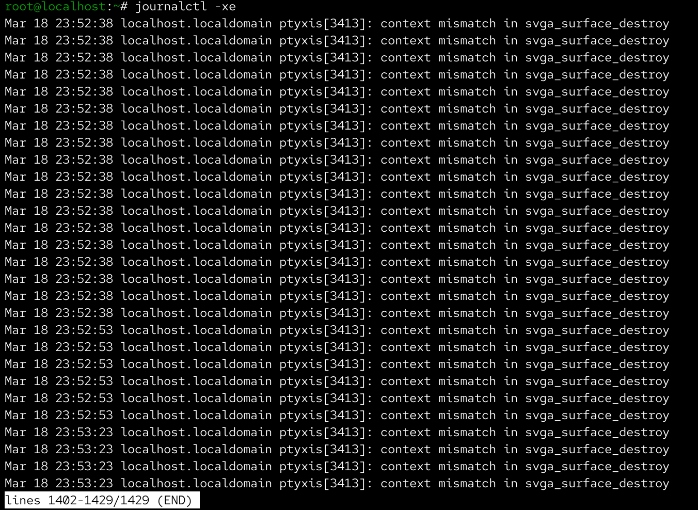

Linux Server Hardening and Monitoring

📌 Project Overview

Enhanced Linux server security and monitored system performance using various tools and configurations.

⚙️ Technologies Used

- Linux
- SSH
- Firewall
- System Monitoring Tools

🔧 Implementation Steps

- Disabled root SSH login
- Configured SSH security settings
- Applied firewall rules
- Monitored system using top, df, free
- Analyzed logs using journalctl

📸 Screenshots

## installfirewalld

## sshdconfigfile

## permitrootno

## sshdstatus

## firewalllist

## monitoring

## diskspace

## logs

✅ Outcome

- Improved server security
- Enabled real-time system monitoring
