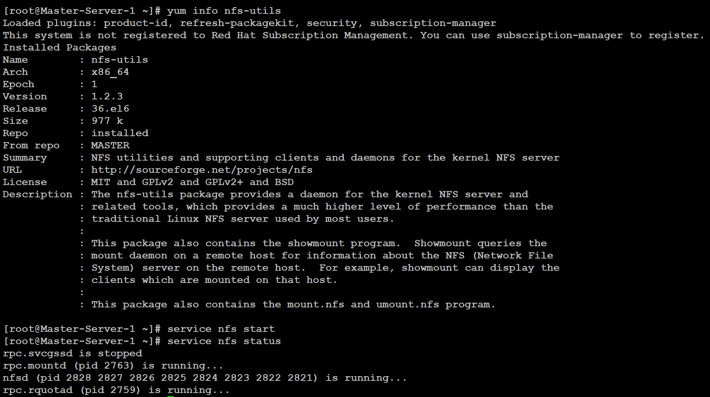

NFS File Sharing and Local YUM Repository Setup (Linux)

📌 Project Overview

Implemented centralized file sharing using NFS and configured a local YUM repository for efficient package management.

⚙️ Technologies Used

- Linux
- NFS
- YUM Repository
- Networking

🔧 Implementation Steps

- Installed and configured NFS server
- Shared directory across network
- Mounted NFS on client system
- Created local YUM repository using ISO
- Configured repo file for package installation

📸 Screenshots

## NFS
## installnfs-utils

(Add your screenshots here)

✅ Outcome

- Achieved centralized file sharing
- Enabled offline package installation
